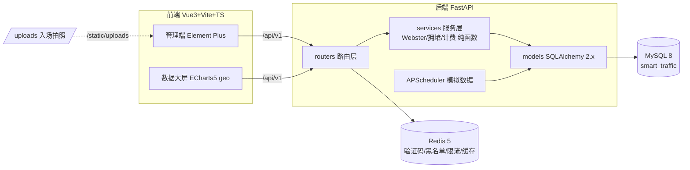

# 🚦 智慧交通综合管理服务平台

> 软件工程课程作业 · B/S 架构单体应用 · Vue3 + FastAPI + MySQL + Redis


## 项目简介

面向城市交通管理场景的综合服务平台，覆盖 **用户权限（RBAC+JWT）、路口与信号配时（Webster 公式）、路况监测（拥堵四级分级）、车辆违章、智慧停车（分时段计费）、车牌识别（HyperLPR3 CPU）、公告反馈、数据可视化大屏、系统仪表盘** 九大模块。

- 三类角色：`admin` 管理员 / `officer` 交警运营 / `user` 普通用户，前端菜单按角色渲染 + 后端接口 403 兜底
- **Excel 报表导出**：违章明细 / 出入场记录 / 路段流量日报，统一风格表头、自动列宽、冻结首行
- **数据治理**：流量时序数据保留策略（`FLOW_RETENTION_DAYS`，默认 90 天，每日 03:30 自动清理）
- **配时方案对比**：任选两个方案分组柱状对比相位绿灯分配；违章支持取证照片上传
- 三个核心算法均为**纯函数**并前后端同源双实现、双侧单测：Webster 配时、拥堵分级、停车计费
- 数据大屏（1920×1080 scale 自适应）：24h 流量趋势、8 路口地图散点、信号分布、违章 TOP5、停车占用、KPI 卡，10 秒轮询 + Redis 缓存（TTL 8s）+ 后端宕机友好降级

## 架构图



## 5 分钟快速启动

> 前置：Node ≥20.19、Python 3.13、MySQL 8（服务 MySQL80）、Redis 5（服务 Redis）已运行。

```bash
# 1) 后端
cd backend
python -m venv venv && source venv/Scripts/activate
pip install -r requirements.txt
cp .env.example .env          # 填 DB_PASSWORD 与 JWT_SECRET
./venv/Scripts/python.exe -m uvicorn app.main:app --port 8000   # 接口文档 http://127.0.0.1:8000/docs

# 2) 数据库（密码从 .env 读取；或直接运行 reset-db.bat）
mysql -uroot -p < sql/init.sql
mysql -uroot -p smart_traffic < sql/seed.sql

# 3) 前端
cd frontend
npm install
npm run dev                   # http://localhost:5173
```

**测试账号**（密码均为 `123456`）：

| 账号 | 角色 |
|---|---|
| admin | 管理员（全部权限） |
| officer | 交警运营（配时/录入/审核/停车/反馈处理） |
| user | 普通用户（大屏/路况/本人车辆违章/反馈） |

> Windows 一键启停：`start.bat` / `stop.bat`；答辩前还原演示数据：`reset-db.bat`。演示动线见 [demo.md](demo.md)。

## 目录结构

```
smart-traffic/
├── backend/          # FastAPI 后端（app/routers|services|models 三层 + tasks + tests）
│   └── uploads/      # 入场拍照（/static/uploads 回显，不入库）
├── frontend/         # Vue3 前端（src/views|api|stores + vitest）
├── docs/             # 课程文档 01-05 + 分工文档（00-05）+ PROGRESS.md 进度台账
├── sql/              # init.sql 建表 + seed.sql 种子数据
├── scripts/          # gen_seed.py 种子生成脚本（可刷新日期重新生成）
├── start.bat / stop.bat / reset-db.bat
└── demo.md           # 答辩演示动线
```

## 质量保障

| 项 | 结果 |
|---|---|
| 后端测试 | `pytest` **119 passed**（独立测试库 smart_traffic_test） |
| 前端测试 | `npm run test` **18 passed**（登录/计费/配时/工具核心模块） |
| 静态检查 | `ruff check` 全绿 / `eslint` 0 problems |
| 构建 | `npm run build` ✓ |
| 文档 | docs/01 需求 · 02 设计（E-R/类图/时序图）· 03 数据库 · 04 测试报告 · 05 部署手册 |

## 分工与协作

- **五人分工**：陈硕（组长·基建/认证权限/系统管理）、郭佳豪（路口信号·Webster/路况监测）、程靖超（车辆违章/Excel 导出）、李嘉诚（智慧停车/车牌识别）、左栋升（公告反馈/数据大屏/集成交付）；
- **分工文档**：`docs/分工/00-分工总览.md`（接口契约/批次计划/协作规范）+ 五份成员开发文档（01-05），每份含需求→设计→编码→测试→验收全流程；
- **远端仓库**：<https://github.com/duyanta123/Intelligent-Transportation>（`main` 保持可运行；五人均以本人 GitHub 账号提交）；
- **提交方式**：按 **10 个批次**（基建 → 认证权限 → 交通 → 违章 → 停车+LPR → 公众服务 → 大屏 → 测试 → 文档 → 一键交付）分阶段推送，每批一个可运行状态；
- **分支规范**：`feature/p{成员号}-{模块}` + PR 合入 `main`，详细操作见 `docs/分工/00-分工总览.md` 第 6.5 节；
- **自动化审查**：PR 触发 GitHub Actions 门禁（仓库卫生/提交规范 + 后端 lint·pytest + 前端 lint·vitest·build + gitleaks 密钥扫描），全绿才能合并；本地同口径自检 `python scripts/precheck.py`，说明见 `docs/分工/06-自动化检查与CI门禁.md`。

## 自动化检查（CI 门禁）

| 检查 | 内容 | 效果 |
|---|---|---|
| 仓库卫生（`repo-guard`） | 禁止 `.env`/`venv`/`node_modules`/`uploads`/模型等入库、单文件 >5MB、硬编码密钥、`.bat` 编码（CRLF+无 BOM）、配置项与 `.env.example` 对账、提交信息 `type(scope): 描述` | 不合规直接拦下，不允许合并 |
| 后端（`backend`） | `ruff check .` + `pytest -q`（CI 内起 MySQL 8.0 与 Redis 5 容器，独立测试库） | 119 个用例必须在干净环境全绿 |
| 前端（`frontend`） | `npm ci` + `eslint` + `vitest` + `vite build` | 保证 `main` 随时可运行 |
| 安全（`security.yml`） | gitleaks 全历史密钥扫描（阻断）+ pip-audit / npm audit（每周一定时提示） | 密钥永不入库 |

本地自检（推之前跑一遍，与 CI 同口径）：

```bash
python scripts/precheck.py --guard-only   # 秒级：仓库卫生 + 提交信息
python scripts/precheck.py                # 全量：与 CI 门禁相同的四组命令
```

一次性远端配置（分支保护、评审人）见 `docs/分工/06-自动化检查与CI门禁.md`。

## 核心算法参数（附录 D 统一口径）

- **Webster**：s=1800 pcu/h/车道；每相位损失 6s；`C0=(1.5L+5)/(1−Y)` 钳制 [40,180]s；绿灯按流量比分配、最短 15s；Y≥0.95 过饱和按上限输出
- **拥堵分级**（v/c）：<0.4 自由流 / 0.4–0.7 缓行 / 0.7–0.9 拥堵 / ≥0.9 严重拥堵；路段通行能力 = 车道数 × 600
- **停车计费**：免费时长 → 首小时 → 每小时（向上取整）→ 单日封顶（每 24h 一段）
- **流量形态**：平峰 300–600、早晚高峰峰值 1500–2200（7:30–9:00 / 17:30–19:00）、夜间 50–150、±10% 噪声、周五晚 ×1.15、周末 ×0.6


