# 智慧交通综合管理服务平台 —— 需求规格说明书

> 版本：1.0　|　日期：2026-09-20　|　项目类型：软件工程课程作业
> 配套文档：《02-系统设计说明书》《03-数据库设计说明书》《04-测试报告》《05-部署与用户手册》

---

## 1. 引言

### 1.1 项目背景

随着城市机动车保有量持续增长，交通拥堵、违章治理难、停车资源不均、信息孤岛等问题日益突出。交通管理部门需要一套集**路况监测、信号配时、违章管理、智慧停车、公众服务**于一体的综合管理平台，以数据驱动的方式提升城市交通运行效率与管理水平。

本项目为软件工程课程作业，模拟建设一个「智慧交通综合管理服务平台」（Smart Traffic Management & Service Platform），B/S 架构，浏览器访问。

### 1.2 项目目标

1. 实现交通业务全流程数字化管理：路口与信号配时、路况监测、车辆违章、智慧停车、公告与投诉反馈；
2. 提供**数据可视化大屏**，支持实时路况态势与核心指标展示；
3. 实践软件工程全流程：需求分析 → 系统设计 → 编码实现 → 测试 → 部署交付；
4. 落地三个核心算法作为答辩亮点：**Webster 信号配时计算**、**拥堵四级分级**、**分时段停车计费**。

### 1.3 读者对象

课程评审教师、答辩评委、项目开发与测试人员。

### 1.4 术语与缩略语

| 术语 | 说明 |
|---|---|
| RBAC | 基于角色的访问控制（Role-Based Access Control） |
| JWT | JSON Web Token，无状态登录凭证 |
| Webster 公式 | 信号交叉口单点配时经典算法，按流量比估算最优周期 |
| pcu/h | 折算标准车当量数/小时，交通流量单位 |
| 饱和度 v/c | 实际流量与通行能力之比，用于拥堵分级 |
| 绿信比 | 一个周期内绿灯时长占比 |

---

## 2. 可行性分析

### 2.1 技术可行性

- 前端采用 Vue 3 + Vite + TypeScript + Element Plus + ECharts 5，均为业界成熟且社区活跃的技术栈；
- 后端采用 Python 3.13 + FastAPI + SQLAlchemy 2.x + MySQL 8 + Redis 5，开发效率高、类型友好；
- 车牌识别采用 HyperLPR3（onnxruntime CPU 推理），无需 GPU 即可运行，准确率 95%+；
- 本机已实测具备 Node 22 / Python 3.13 / MySQL 8（服务 MySQL80）/ Redis 5.0.14（服务 Redis）运行环境，无需容器。

### 2.2 经济可行性

全部使用开源免费软件，无商业授权费用；开发与运行均在本地单机完成，无云资源开销。

### 2.3 操作可行性

系统面向三类用户（管理员/交警/普通用户），界面遵循 Element Plus 交互规范，全中文界面；管理端布局（侧边菜单+面包屑）符合主流后台习惯，普通用户无需培训即可上手。

### 2.4 法律与合规可行性

所引用开源组件均为 MIT/Apache 等宽松协议；借鉴开源项目的设计思想（见下表）而非整段复制代码，符合学术与许可规范。

| 参考项目 | 借鉴点 |
|---|---|
| OpenATC | 信号配时、绿信比、相位模型 |
| dromara/go-view | 大屏 scale 自适应方案与视觉风格 |
| HyperLPR | 车牌识别模型选型 |
| mark.w 停车系统 | 出入场与计费模型 |
| SUMO/CityFlow | 流量模拟数据规律 |

---

## 3. 用户角色与权限

系统共 3 类角色，采用 RBAC（用户-角色-菜单）三级控制：

| 菜单/功能 | admin（管理员） | officer（交警/运营） | user（普通用户） |
|---|---|---|---|
| 系统仪表盘 | ✓ | ✓（简版） | — |
| 用户/角色/菜单/操作日志 | ✓ | — | — |
| 路口与信号灯管理 | ✓（全权） | 查看 + 配时计算 | — |
| 路况监测 | ✓ | ✓ | 查看 |
| 车辆与违章管理 | ✓ | 录入 + 审核 | 仅本人车辆与违章查询 |
| 智慧停车 | ✓ | ✓ | 查看剩余车位 |
| 车牌识别 | ✓ | ✓ | — |
| 公告资讯 | 发布/管理 | 查看 | 查看 |
| 投诉反馈 | ✓ | 受理/处理 | 提交 + 跟踪本人工单 |
| 数据可视化大屏 | ✓ | ✓ | ✓ |

---

## 4. 用例模型

### 4.1 系统用例图

```mermaid
graph TB
    subgraph 智慧交通综合管理服务平台
        UC1(登录/注册/验证码)
        UC2(用户与角色管理)
        UC3(菜单与操作日志管理)
        UC4(路口管理)
        UC5(信号配时管理)
        UC6(Webster 配时计算)
        UC7(信号灯实时状态)
        UC8(路段与流量管理)
        UC9(流量上报/拥堵监测)
        UC10(历史流量查询)
        UC11(车辆登记)
        UC12(违章录入)
        UC13(违章审核/处理)
        UC14(停车场管理)
        UC15(车辆入场)
        UC16(车辆出场结算)
        UC17(计费规则管理)
        UC18(车牌识别)
        UC19(公告发布/浏览)
        UC20(投诉反馈提交)
        UC21(投诉受理处理)
        UC22(数据可视化大屏)
        UC23(系统仪表盘)
    end

    Admin([管理员])
    Officer([交警/运营人员])
    User([普通用户])

    Admin --> UC1
    Admin --> UC2 & UC3
    Admin --> UC4 & UC5 & UC6 & UC7
    Admin --> UC8 & UC9 & UC10
    Admin --> UC11 & UC12 & UC13
    Admin --> UC14 & UC15 & UC16 & UC17
    Admin --> UC18
    Admin --> UC19 & UC21
    Admin --> UC22 & UC23

    Officer --> UC1
    Officer --> UC5 & UC6 & UC7
    Officer --> UC8 & UC9 & UC10
    Officer --> UC11 & UC12 & UC13
    Officer --> UC14 & UC15 & UC16
    Officer --> UC18
    Officer --> UC19 & UC21
    Officer --> UC22 & UC23

    User --> UC1
    User --> UC8 & UC10
    User --> UC11
    User --> UC14
    User --> UC19 & UC20
    User --> UC22
```

### 4.2 关键用例描述表

#### 用例 1：登录认证

| 项目 | 内容 |
|---|---|
| 用例编号 | UC-01 |
| 参与者 | 所有角色 |
| 前置条件 | 账号已存在且状态为启用 |
| 基本流程 | 1. 打开登录页，系统返回图形验证码（存 Redis，TTL 300s）；2. 输入用户名/密码/验证码提交；3. 校验验证码（一次性，校验后即删）；4. 校验密码（bcrypt）；5. 签发 JWT（2 小时有效）；6. 记录操作日志并进入对应角色首页 |
| 异常流程 | 3a. 验证码错误 → 提示重新输入；4a. 密码错误 → 失败计数 +1，连续 5 次锁定账号与 IP 10 分钟；4b. 账号禁用 → 提示联系管理员 |
| 后置条件 | Redis 记录登录态；失败计数/锁定状态存 Redis |
| 备注 | 登出后 JWT 进入 Redis 黑名单，剩余有效期后自动清除 |

#### 用例 2：信号配时计算（Webster）

| 项目 | 内容 |
|---|---|
| 用例编号 | UC-06 |
| 参与者 | admin、officer |
| 前置条件 | 路口已创建，已知各相位关键车流量与车道数 |
| 基本流程 | 1. 在「信号配时」页输入各相位流量与车道数；2. 调用 `/signal-plans/calc`；3. 后端按 Webster 公式计算最优周期 C0 与各相位绿灯时长；4. 前端展示结果并可一键保存为配时方案 |
| 业务规则 | 饱和流量 s=1800 pcu/h/车道；y_i=q_i/(s×n_i)；L=Σ(启动损失 3s+黄灯 3s 含全红 1s)；C0=(1.5L+5)/(1−Y) 钳制 [40,180]s；绿灯按 y_i/Y 分配，最短 15s；Y≥0.95 判定过饱和，按上限周期输出 |
| 异常流程 | 流量/车道数非法 → 422 参数校验失败 |
| 后置条件 | 可选：保存方案并启用，信号灯实时状态按新周期轮转 |

#### 用例 3：车辆入场与出场结算

| 项目 | 内容 |
|---|---|
| 用例编号 | UC-15/16 |
| 参与者 | admin、officer |
| 前置条件 | 停车场与计费规则已配置 |
| 基本流程 | 入场：1. 选择停车场、录入车牌（可上传入场拍照，限 5MB jpg/png/webp）；2. 校验车牌格式（支持新能源 8 位）、重复入场、车位余量；3. 生成在场记录，占用数 +1。出场：1. 录入车牌；2. 按计费规则计算费用（免费时长/首小时/每小时/单日封顶）；3. 记录出场时间与费用，占用数 −1 |
| 异常流程 | 车位已满 → 30001；重复入场 → 30002；无在场记录 → 30003 |
| 后置条件 | 出入场记录可查询，费用明细留存 |

#### 用例 4：违章录入与审核

| 项目 | 内容 |
|---|---|
| 用例编号 | UC-12/13 |
| 参与者 | officer/admin 录入与审核 |
| 前置条件 | 违章类型字典已配置（闯红灯/超速/违停/不按导向车道行驶） |
| 基本流程 | 1. officer 录入违章（车牌、类型、时间、地点、罚款、记分）→ 状态「待审核」；2. officer/admin 审核：通过（已确认）或驳回（已驳回）；3. 已确认的违章可标记「已处理」（缴费/记分完成） |
| 业务规则 | 状态流转：pending → confirmed/rejected → processed；审核人、审核时间、备注全程留痕 |
| 异常流程 | 重复审核 → 20003；非确认状态标记处理 → 20004 |
| 后置条件 | 普通用户可在本人车辆维度查询违章 |

#### 用例 5：投诉反馈处理

| 项目 | 内容 |
|---|---|
| 用例编号 | UC-20/21 |
| 参与者 | user 提交；officer/admin 受理处理 |
| 基本流程 | 1. user 提交反馈（标题+内容）→ 「待受理」；2. officer/admin 受理 → 「处理中」并填写答复；3. 办结 → 「已办结」；user 可全程跟踪本人工单 |
| 异常流程 | 已办结工单不可再次处理 → 40001 |
| 后置条件 | 处理人、处理时间留痕，进入操作日志 |

---

## 5. 功能需求

### 5.1 用户与权限模块

- 注册、登录（图形验证码，存 Redis，TTL 5 分钟）、修改密码；
- RBAC：角色-菜单-权限三级控制；JWT 有效期 2 小时，登出 token 进 Redis 黑名单；
- 登录限流：同一账号或同一 IP 连续失败 5 次锁定 10 分钟（计数与锁定状态存 Redis）；
- 操作日志：登录、增删改、审核等关键操作全量留痕，admin 可查询。

### 5.2 路口与信号灯管理

- 路口 CRUD（名称、经纬度、车道数、辖区），内置 8 个固定路口种子数据；
- 配时方案管理：周期时长、相位、绿信比；支持「定周期」与「感应自适应」两种模式；同一路口同时仅一个启用方案；
- Webster 配时计算（见用例 2，核心算法、纯函数实现、前后端同源双实现）；
- 信号灯实时状态查询（供大屏轮询），模拟任务每 10 秒推进相位。

### 5.3 路况监测

- 路段管理（起止路口、车道数、长度、走向、通行能力=车道数×600）；
- 流量数据：模拟上报接口 + APScheduler 每分钟生成模拟数据（`.env` 开关 `MOCK_DATA_ENABLED` 可关闭）；
- 拥堵四级自动分级（按饱和度 v/c：<0.4 自由流；0.4–0.7 缓行；0.7–0.9 拥堵；≥0.9 严重拥堵）；
- 历史流量查询：按路段、按小时/天聚合（平均/峰值流率、平均车速）。

### 5.4 车辆与违章管理

- 车辆登记：车牌正则校验（省份简称+发牌机关字母+序号，支持新能源 8 位牌）；
- 违章录入、列表、多维筛选、审核与状态流转（见用例 4）；
- 违章类型字典：闯红灯（罚 200 记 6）、超速（罚 200 记 3）、违停（罚 150 记 0）、不按导向车道行驶（罚 100 记 2）。

### 5.5 智慧停车模块

- 停车场管理：总数/占用/剩余车位、占用率；
- 出入场记录：入场拍照（图片存 `backend/uploads/`，经 `/static/uploads` 回显，限 5MB、jpg/png/webp）、出场结算；
- 计费引擎：免费时长 → 首小时 → 每小时（不足按 1 小时）→ 单日封顶（每 24 小时一段）；核心函数为纯函数并有单元测试。

### 5.6 车牌识别模块（加分项）

- 上传车辆图片 → HyperLPR3（onnxruntime CPU）识别 → 返回车牌号与置信度 → 可复制填入出入场/违章表单；
- 接口 10 秒超时保护；应用启动时后台预热模型（首次运行自动下载约 12MB 并缓存）；
- 降级路径：模型不可用/超时/未识别时返回结构化错误，前端引导「手动录入车牌」。

### 5.7 公共服务模块

- 公告管理：admin 发布/编辑/下架/删除，其余角色浏览已发布公告；
- 投诉反馈：user 提交 → officer 受理处理 → 状态可追踪（见用例 5）。

### 5.8 数据可视化大屏（独立全屏页）

至少 6 图表 + 1 地图，10 秒轮询 `/dashboard/realtime`（后端 Redis 缓存 TTL 8 秒）：

1. 全市车流量 24 小时趋势（折线）；
2. 各路口实时拥堵等级（ECharts geo 地图散点 + 自定义模拟路网坐标）；
3. 信号灯状态分布（环形图）；
4. 违章类型 TOP5（柱状，近 7 天）；
5. 停车场车位占用率（横向条形）；
6. 今日核心指标卡：车流量、平均车速、违章数、投诉待处理数；
7. scale 等比缩放自适应（1920×1080 设计稿），后端不可用时全屏友好降级提示。

### 5.9 系统仪表盘（管理端首页）

- 管理员视角统计概览（用户数、车辆数、今日违章、待处理事项、停车占用）；
- 近 7 天流量趋势、违章类型分布、最近操作日志；officer 视角为简版（不含用户统计）。

---

## 6. 非功能需求

| 类别 | 需求 |
|---|---|
| 性能 | 常规列表接口 < 500ms；大屏聚合接口走 Redis 缓存（TTL 8s）支撑 10s 轮询；测试库与正式库隔离 |
| 安全 | 密码 bcrypt 存储；JWT 2h 过期 + 黑名单；登录限流；上传文件类型/大小白名单；密钥一律走 `.env`，禁止硬编码 |
| 兼容性 | Chrome/Edge 现代浏览器；大屏适配任意分辨率（scale 等比缩放） |
| 可维护性 | 后端三层架构 router→service→model；前后端统一响应 `{code, message, data}`；错误码分段（1xxxx 用户/2xxxx 交通/3xxxx 停车/4xxxx 公共/9xxxx 系统） |
| 可测试性 | 核心算法纯函数化；pytest 独立测试库 `smart_traffic_test`；前端 vitest |
| 国际化 | 全部界面文案简体中文，代码注释中文 |
| 时区 | 全链路 Asia/Shanghai 本地时间，数据库一律 DATETIME，禁止 UTC 混用 |
