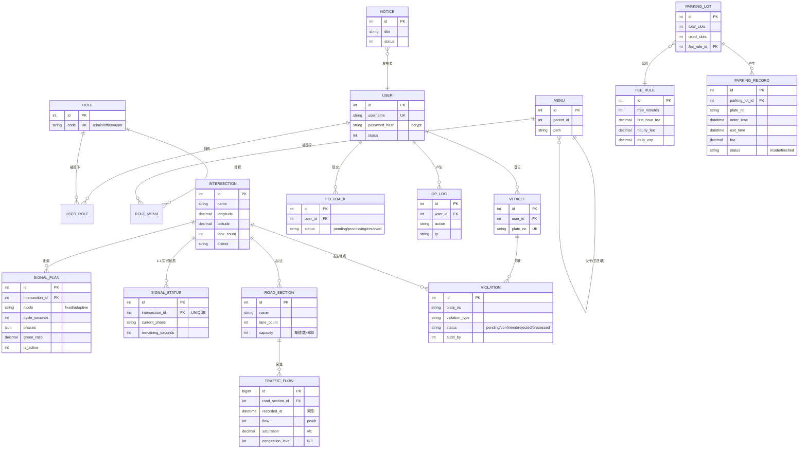
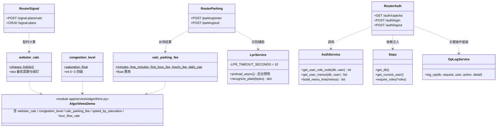
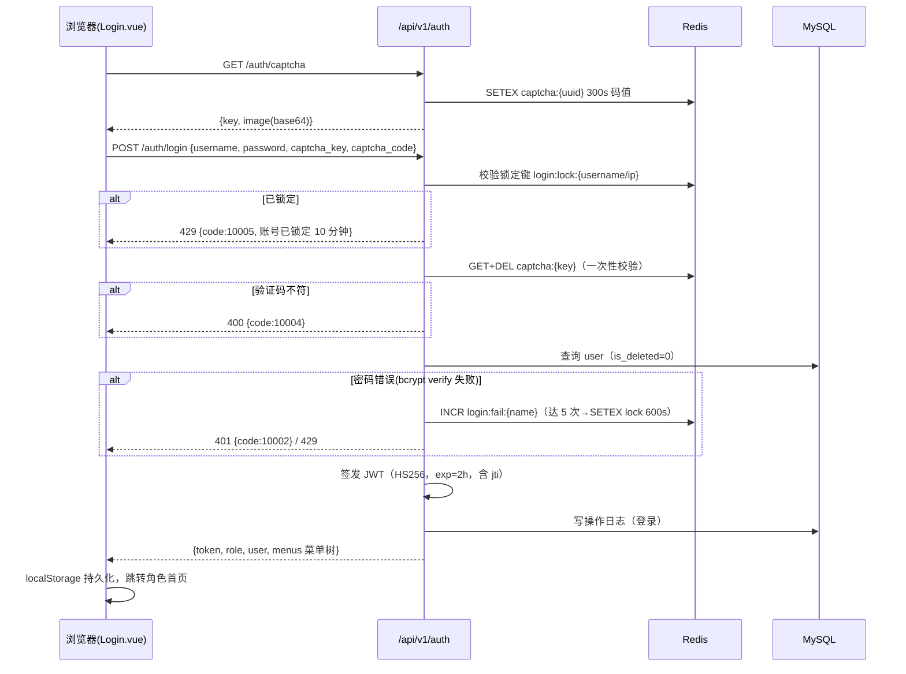
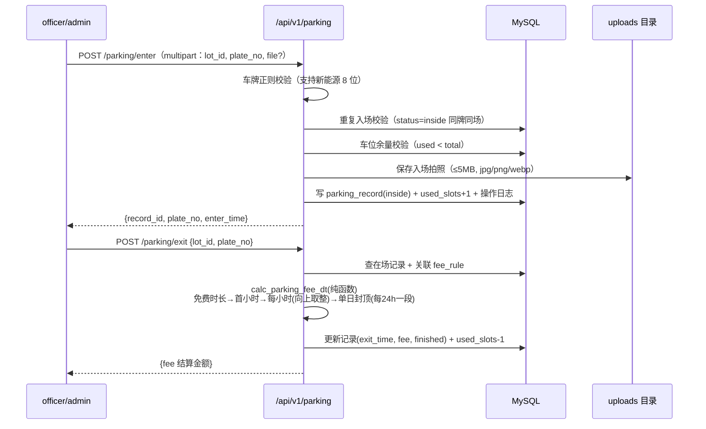
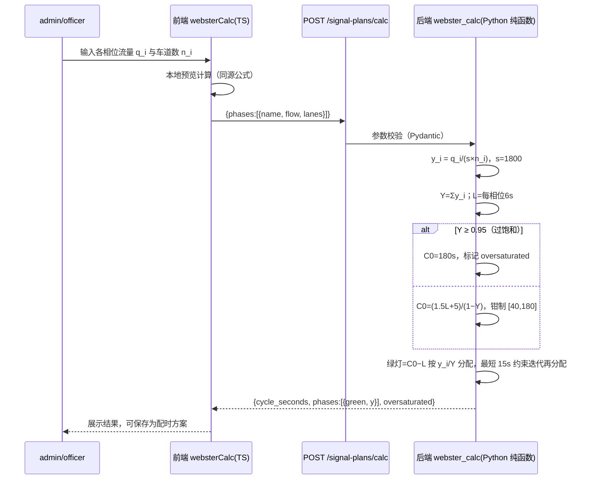
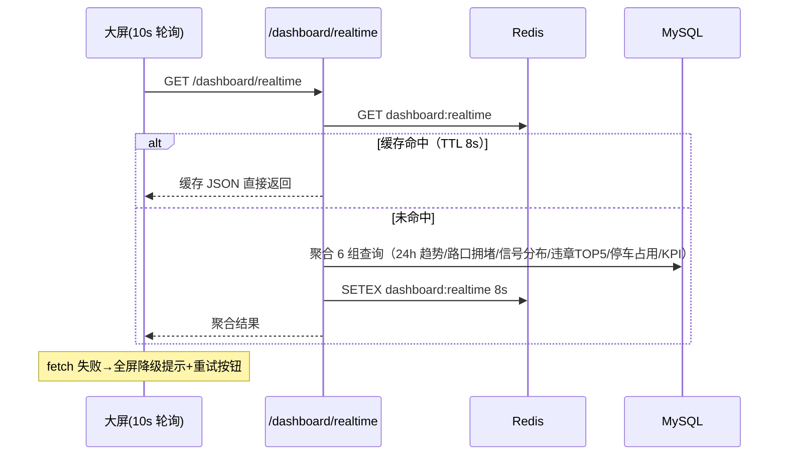

# 智慧交通综合管理服务平台 —— 系统设计说明书

> 版本：1.0　|　日期：2026-09-20　|　配套：《01-需求规格说明书》《03-数据库设计说明书》

---

## 1. 总体架构

### 1.1 架构图（分层单体，三层分离）

```mermaid
graph TB
    subgraph 浏览器端
        BS[数据可视化大屏<br/>scale 等比缩放]
        MP[管理端页面<br/>侧边菜单 + 面包屑]
    end

    subgraph 前端 Vue3 + Vite + TS
        RT[Vue Router 路由守卫]
        ST[Pinia 状态管理]
        AX[Axios 拦截器<br/>JWT 注入/统一错误]
        EP[Element Plus 组件库]
        EC[ECharts 5 图表]
        RT --> ST --> AX
        MP --> EP
        BS --> EC
    end

    subgraph 后端 FastAPI（app/）
        R[routers 路由层<br/>auth/system/signal/traffic/<br/>violation/parking/lpr/service/dashboard/admin]
        S[services 服务层<br/>algorithms 纯函数/Webster·拥堵·计费<br/>auth_service/oplog/lpr_service]
        M[models 模型层<br/>SQLAlchemy 2.x · 18 张表]
        T[tasks 定时任务<br/>APScheduler 模拟数据]
        C[core 基础设施<br/>config/database/redis/security/deps]
        R --> S --> M
        R --> C
        T --> M
    end

    DB[(MySQL 8<br/>smart_traffic)]
    RD[(Redis 5<br/>验证码/黑名单/限流/大屏缓存)]
    FS[/backend/uploads<br/>入场拍照/识别图片/]

    MP -->|/api/v1 RESTful| R
    BS -->|10s 轮询| R
    M --> DB
    C --> RD
    FS -->|静态回显 /static/uploads| MP
```

### 1.2 技术选型理由

| 层 | 选型 | 理由 |
|---|---|---|
| 前端框架 | Vue 3（组合式 API）+ TypeScript | 渐进式、组合式逻辑复用好；TS 提供编译期类型保障 |
| 构建 | Vite 6 | 原生 ESM 秒级冷启动，Node 22 完全兼容 |
| UI 组件 | Element Plus | 企业级中后台组件齐全、全中文文档 |
| 图表 | ECharts 5 | 国产开源、geo 地图/大屏能力强，go-view 同款 |
| 状态 | Pinia | Vue3 官方推荐，TS 友好 |
| 后端框架 | FastAPI | 异步高性能、自动生成 /docs 接口文档、Pydantic 校验 |
| ORM | SQLAlchemy 2.x | Python 事实标准，2.0 风格 typed mapped_column |
| 数据库 | MySQL 8（utf8mb4_general_ci） | 课程要求与本地实测环境；关系型适合业务数据 |
| 缓存 | Redis 5.0.14 | 验证码/黑名单/限流/大屏缓存；仅使用 5.x 支持命令（RESP2） |
| 认证 | JWT（python-jose）+ bcrypt 4.0.1 | 无状态认证；bcrypt 钉死 <4.1 规避 passlib 兼容问题 |
| 定时任务 | APScheduler 3.10 | 进程内调度，无需外部中间件 |
| 车牌识别 | HyperLPR3（onnxruntime CPU） | 中文车牌识别 95%+，纯 CPU 可跑，免 GPU |

### 1.3 接口设计规范

- 统一前缀 `/api/v1`，统一响应结构 `{code: int, message: str, data: any}`；
- HTTP 状态码照常表达 401/403/404/422/500；业务 code 分段：`0` 成功、`1xxxx` 用户与权限、`2xxxx` 交通业务、`3xxxx` 停车与计费、`4xxxx` 公共服务、`9xxxx` 系统错误；
- 分页参数 `page/size`，返回 `{list, total, page, size}`；
- 完整接口清单见《智慧交通-项目开发Prompt.md》附录 C，实现一致，运行时可在 `http://127.0.0.1:8000/docs` 查看 Swagger。

---

## 2. 数据模型设计（E-R 图）

### 2.1 E-R 图



### 2.2 设计要点

1. 所有表含 `id`（自增主键）、`created_at`、`updated_at`；软删除统一 `is_deleted`，禁止物理 DELETE 业务数据；
2. 表间仅建**逻辑外键**（应用层保证一致性），不设物理外键约束，便于种子导入与软删除；
3. 时间字段一律 `DATETIME`（Asia/Shanghai 本地时间）；`traffic_flow.recorded_at` 建复合索引 `(road_section_id, recorded_at)` 支撑历史查询；
4. `signal_plan.phases` 使用 JSON 类型存相位数组 `[{name, green, yellow, allRed}]`。

---

## 3. 核心类图（后端服务层）



设计原则：**三个核心算法（配时/拥堵/计费）全部为纯函数**——不碰数据库、输入输出明确，前后端同源双实现（前端用于即时预览，后端为权威计算），两侧均有单元测试保证一致性。

---

## 4. 关键流程时序图

### 4.1 登录认证（含验证码、限流、JWT）



登出流程：`POST /auth/logout` → 校验 token → `SETEX token:blacklist:{token} 剩余有效期` → 后续请求在 `get_current_user` 中被黑名单拦截（401）。

### 4.2 出入场计费



### 4.3 Webster 配时计算



### 4.4 大屏数据轮询（Redis 缓存）



---

## 5. 前端架构设计

### 5.1 目录与职责

```
frontend/src/
├── api/          # 按模块划分的接口封装（auth/traffic/vehicle/parking/service/dashboard）
├── stores/       # Pinia：auth（token/用户/菜单/角色）
├── router/       # 静态路由 + 登录守卫（meta.standalone 大屏独立全屏）
├── utils/        # algorithms.ts（Webster/计费 TS 同源实现）
├── views/        # login / layout / dashboard / system / traffic / vehicle / parking / tools / service / bigscreen
└── styles/       # 全局样式
```

### 5.2 权限与路由

- 登录后端返回该角色可见**菜单树**，侧边栏据此渲染；路由守卫仅校验登录态，页面级操作权限由后端 `require_roles` 兜底（前端隐藏入口 + 后端 403 双保险）；
- 大屏 `/big-screen` 为独立全屏路由（不套管理布局），按 1920×1080 设计稿 `scale = min(w/1920, h/1080)` 等比缩放（借鉴 go-view 方案）。

### 5.3 降级策略

Axios 响应拦截器统一处理：`code!==0` 弹错误提示；401 清理本地态跳登录页；网络异常提示「请检查后端服务是否启动」。大屏在轮询失败时展示全屏降级卡片并提供「重新连接」，恢复后 10s 定时器自动回填数据。

---

## 6. 后端架构设计

```
backend/app/
├── main.py          # 应用入口：CORS/统一异常/静态目录/路由注册/启动钩子
├── core/            # config(.env) / database / redis_client / security(JWT+bcrypt) / response(统一响应+错误码) / deps(认证与RBAC依赖)
├── models/          # 18 张表 SQLAlchemy 2.0 模型
├── schemas/         # Pydantic v2 请求模型
├── services/        # algorithms(纯函数) / auth_service / oplog / lpr_service
├── routers/         # auth / system / signal / traffic / violation / parking / lpr / service / dashboard / admin
├── tasks/           # APScheduler：每分钟流量模拟、每 10 秒信号灯相位推进（MOCK_DATA_ENABLED 开关）
└── utils/           # captcha 图形验证码 / validators 车牌校验与分页
```

关键机制：

1. **统一响应**：`BizError(code, message, http_status)` 由全局异常处理器转 `{code, message, data}`；RequestValidationError 转 422；
2. **认证依赖**：`get_current_user` 解析 Bearer token → Redis 黑名单校验 → 加载用户；`require_roles('admin')` 工厂做角色鉴权；
3. **模型预热**：启动钩子后台线程预载 HyperLPR3 模型（首次自动下载约 12MB），请求侧 10 秒超时保护，失败可重试、自动降级；
4. **静态回显**：`/static/uploads` 挂载 `backend/uploads/`，上传限 5MB、jpg/png/webp；
5. **报表导出**：`export` 路由 + `excel_service`（openpyxl）统一生成带标题/冻结表头/自动列宽的 xlsx，StreamingResponse 下载；
6. **数据治理**：`cleanup_flow_data` 每日 03:30 物理清理超过 `FLOW_RETENTION_DAYS`（默认 90 天）的流量时序数据（遥测数据生命周期管理，非业务单据，保留期可配置、0=禁用）。
