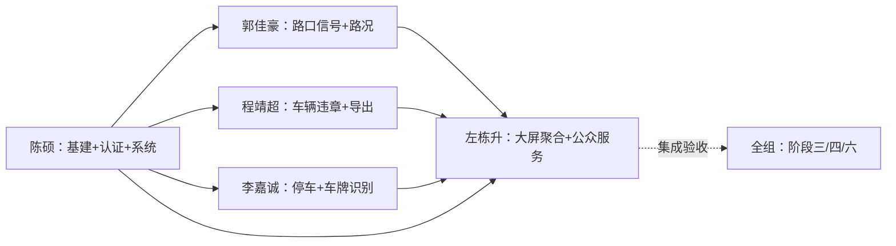

# 00 · 分工总览 —— 智慧交通综合管理服务平台

> 文档版本：v1.0　|　编制人：陈硕（组长）　|　配套文档：《01-陈硕-项目基建与认证权限》《02-郭佳豪-路口信号与路况监测》《03-程靖超-车辆与违章管理》《04-李嘉诚-智慧停车与车牌识别》《05-左栋升-公众服务与数据大屏及交付》
> 使用方式：本文说明"项目怎么切、谁做哪一块、按什么顺序做、共同遵守什么"；每位成员的实施步骤、函数级清单、接口清单、测试用例编号与验收命令，见各自的成员文档。

---

## 1. 项目一句话与全景

智慧交通综合管理服务平台（B/S 单体三层架构）：Vue3 + Vite + TypeScript + Element Plus + ECharts 5 前端，FastAPI + SQLAlchemy 2.x + MySQL 8 + Redis 5 后端，覆盖 **登录权限（RBAC+JWT）、系统管理、路口与信号配时（Webster）、路况监测（拥堵四级分级）、车辆违章、智慧停车（分时段计费）、车牌识别（HyperLPR3）、公告反馈、数据可视化大屏、系统仪表盘** 十项能力，三类角色 `admin / officer / user`。

工程规模：后端 12 个 router / 18 张表 / 3 个核心纯函数算法；前端 20 个页面；后端 pytest 119 例、前端 vitest 18 例、ruff + eslint 零告警、`npm run build` 通过。

---

## 2. 五人分工总表

| 文档 | 成员 | 角色 | 负责主线 | 核心代码资产 | 一句话职责 |
|---|---|---|---|---|---|
| 01 | **陈硕** | 组长 | 项目基建 + 认证权限（RBAC/JWT）+ 系统管理 + 通用层 | `core/*`、`routers/auth.py`、`routers/system.py`、`routers/admin.py`、`services/auth_service.py`、`services/oplog.py`、`utils/captcha.py`、登录页、布局、系统管理 4 页 | 把地基和"门禁"建好，让其他四人能直接开工 |
| 02 | **郭佳豪** | 开发 | 路口与信号配时（Webster）+ 路况监测（拥堵分级）+ 模拟数据任务 | `routers/signal.py`、`routers/traffic.py`、`services/algorithms.py`（Webster/拥堵）、`tasks/scheduler.py`、交通 4 页 | 提供路口/路段/信号/流量主数据与两个核心算法 |
| 03 | **程靖超** | 开发 | 车辆与违章管理 + Excel 报表导出 + 车牌校验公共函数 | `routers/violation.py`、`routers/export.py`、`services/excel_service.py`、`utils/validators.py`（车牌部分）、车辆违章 2 页 | 打通"车辆登记 → 违章录入 → 审核 → 处理"状态机 |
| 04 | **李嘉诚** | 开发 | 智慧停车 + 车牌识别 + 通用上传 | `routers/parking.py`、`routers/lpr.py`、`routers/files.py`、`services/algorithms.py`（计费）、停车 3 页 + LPR 页 | 交付出入场结算闭环与车牌识别链路 |
| 05 | **左栋升** | 开发/集成/交付 | 公告反馈 + 数据大屏 + 系统仪表盘聚合 + 集成联调交付 | `routers/service.py`、`routers/dashboard.py`、大屏页、`start.bat/stop.bat/reset-db.bat`、`demo.md` | 公众服务闭环 + 答辩门面 + 集成与交付收口 |

分工原则：每人一条**完整业务链**（从表 → 路由 → 页面 → 测试 → 文档），每人至少负责一个**答辩亮点**，工作量按后端行数/接口数/测试数拉平。

| 成员 | 后端接口数 | 负责表数 | 负责后端测试例数 | 亮点 |
|---|---|---|---|---|
| 陈硕 | 17 | 6 | 18（test_auth 15 + AdminStats 3） | JWT + Redis 黑名单 + 验证码一次性 + 改密吊销 |
| 郭佳豪 | 15 | 5 | 30（test_algorithms 30，其中 TestParkingFee 8 例归李嘉诚） | Webster 配时 + 拥堵分级 |
| 程靖超 | 14 | 2 | 21（violation 13 + 导出 4 + 车牌 4） | 违章状态机 + Excel 导出 |
| 李嘉诚 | 14 | 3 | 21（parking 10 + 计费 8 + 上传 3） | 停车计费 + HyperLPR3 车牌识别 |
| 左栋升 | 10 | 2 | 10（test_service 中 Notice/Feedback/Dashboard 10 例，TestAdminStats 3 例归陈硕） | 大屏聚合 + Redis 缓存 + 降级 |

---

## 3. 模块-人员映射（防扯皮）

| 业务链 | 数据库表 | 后端路由 | 前端页面 | Owner |
|---|---|---|---|---|
| 登录认证 | user / role / user_role | routers/auth.py | login/Login.vue、layout/Layout.vue、stores/auth.ts | 陈硕 |
| 系统管理 | menu / role_menu / op_log | routers/system.py、routers/admin.py | system/users·roles·menus·logs.vue、dashboard/index.vue | 陈硕 |
| 路口信号 | intersection / signal_plan / signal_status | routers/signal.py | traffic/intersections.vue、traffic/signal-plans.vue | 郭佳豪 |
| 路况监测 | road_section / traffic_flow | routers/traffic.py、tasks/scheduler.py | traffic/sections.vue、traffic/flow.vue | 郭佳豪 |
| 车辆违章 | vehicle / violation | routers/violation.py | vehicle/vehicles.vue、vehicle/violations.vue | 程靖超 |
| 报表导出 | 只读上述表 | routers/export.py、services/excel_service.py | 各列表页"导出 Excel"按钮 | 程靖超 |
| 智慧停车 | fee_rule / parking_lot / parking_record | routers/parking.py | parking/lots·records·fee-rules.vue | 李嘉诚 |
| 车牌识别 | 不落库 | routers/lpr.py、routers/files.py、services/lpr_service.py | tools/lpr.vue | 李嘉诚 |
| 公众服务 | notice / feedback | routers/service.py | service/notices.vue、service/feedback.vue | 左栋升 |
| 数据大屏 | 只读聚合 | routers/dashboard.py | bigscreen/index.vue | 左栋升 |

**共享文件（禁止任何人私自大改，改动先提 PR 由陈硕合并）**：`backend/app/models/__init__.py`、`backend/app/schemas/__init__.py`、`backend/app/main.py`、`frontend/src/router/index.ts`、`frontend/src/api/http.ts`、`frontend/src/styles/global.css`。

---

## 4. 人员依赖与关键路径



- **强依赖 1（所有人 → 陈硕）**：登录拿 token、`require_roles` 权限依赖、统一响应 `ok()/BizError`、`log_op()`、菜单下发、路由守卫都是公共地基；第 1 周不完成，其余四人全部阻塞。
- **强依赖 2（左栋升 → 郭佳豪）**：`/dashboard/realtime` 的 24h 流量趋势、路口拥堵散点、路网连线全部读 `traffic_flow`，模拟任务不跑起来大屏没数据。
- **弱依赖**：程靖超的违章地点下拉依赖郭佳豪的路口主数据；李嘉诚复用程靖超的车牌校验函数；导出的三类报表依赖三人业务表字段冻结。
- **集成收口**：左栋升负责阶段三全链路联调；陈硕负责阶段五文档统稿与阶段六终验；导入顺序固定 `sql/init.sql` → `sql/seed.sql`。

---

## 5. 统一技术规范（全组铁律，写码前必读）

### 5.1 接口规范
- 统一前缀 `/api/v1`，统一响应结构：成功 `{"code": 0, "message": "操作成功", "data": ...}`，失败 `{"code": 非0, "message": "...", "data": null}`；HTTP 状态码照常表达 401/403/404/422/429/500；
- 分页入参 `page/size`，返回 `{"list": [], "total": n, "page": 1, "size": 20}`；`size` 由 `clamp_page()` 钳制（默认上限 100）；
- 列表页规范：查询条件变更必须重置到第 1 页；删除当前页最后一条自动回退页码；快速切换筛选/翻页必须用 `utils/async.ts` 的 `sequenceGuard` 防竞态。

### 5.2 错误码分段（定义在 `backend/app/core/response.py`，禁止各模块自造）

| 段位 | 归属 | 已定义错误码 |
|---|---|---|
| 1xxxx | 用户与权限（陈硕） | 10001 未登录/过期 401、10002 用户名或密码错误 401、10003 无权限 403、10004 验证码错误 400、10005 账号锁定 429、10006 用户名已存在 400、10007 账号禁用 403、10008 原密码错误 400 |
| 2xxxx | 交通业务（郭佳豪/程靖超） | 20001 记录不存在 404、20002 车牌格式错误 400、20003 违章已审核 400、20004 仅审核通过可处理 400、20005 车牌已登记 400、20006 配时不可行 400 |
| 3xxxx | 停车与计费（李嘉诚） | 30001 车位已满 400、30002 该车牌已在场内 400、30003 未找到在场记录 404 |
| 4xxxx | 公共服务（左栋升） | 40001 反馈已办结 400 |
| 9xxxx | 系统（全组） | 90000 系统繁忙 500、90001 参数校验失败 422、90002 上传失败 400、90003 车牌识别失败 503 |

### 5.3 数据规范
- 所有表含 `id / created_at / updated_at / is_deleted`，查询一律带 `is_deleted == 0`；
- 时间字段一律 `DATETIME` **本地时间（Asia/Shanghai）**；前端传参经后端 `to_local_naive()` 转换；前端展示用 `frontend/src/utils/datetime.ts`，**禁止 `toISOString()` 直传**；
- 唯一索引与软删冲突用"墓碑后缀"方案（删除车辆时 `plate_no` 改写为 `*{id}`，见 `violation.delete_vehicle`）；
- 金额字段 `Numeric(8,2)`，出参前 `float()`；密钥类配置一律 `.env`（仓库只留 `.env.example`）。

### 5.4 编码规范
- 后端：路由层只做参数校验与权限，业务下沉 `services/`；核心算法必须**纯函数**（不碰数据库、不读全局状态、不随机）；函数带 docstring 与类型标注；
- 前端：组合式 API + `<script setup lang="ts">`；请求统一走 `api/http.ts`；列表页接 `sequenceGuard`；
- 提交前必须通过：`ruff check app tests`、`npx eslint src tests`。

### 5.5 测试与验收规范
- 后端：每个功能模块一个测试文件；测试库 `smart_traffic_test`（`conftest.py` 自动建库建表），禁止污染正式库；`TESTING=1` 时不启动调度器与模型预热；
- 前端：核心算法与工具必须有 vitest 用例；
- 每人交付前必跑：
```powershell
# backend 目录
.\venv\Scripts\python.exe -m pytest tests/ -q
.\venv\Scripts\python.exe -m ruff check app tests
# frontend 目录
npm run test
npx eslint src tests
npm run build
```
- 联调 bug 责任到人：先复现 → 定位 → 当日修复并补回归用例。

### 5.6 Git 与协作规范（详细实操见第 6.5 节）
- **远端仓库**：`https://github.com/duyanta123/Intelligent-Transportation.git`（`main` 为唯一长期分支）；
- 分支 `feature/p{成员序号}-{模块}`（如 `feature/p2-signal`）；`main` 保持可运行；
- 提交信息 `feat(模块): 内容` / `fix(模块): 内容` / `test(模块): 内容`，一次提交只做一件事；
- **五个成员各用自己的 GitHub 账号 push**（本地凭据决定 author，见第 6.5 节），提交历史呈现五个作者；
- 共享文件改动走 PR 且由陈硕 review；接口发布后只加字段不改字段；
- 每日站会 10 分钟（昨天/今天/阻塞），阻塞当天升级给陈硕；每周日更新 `docs/PROGRESS.md`。

---

## 6. 统一对外接口契约（54 个端点，按 Owner 分组）

> 路径省略统一前缀 `/api/v1`；这是"接口冻结"清单，联调期间不得擅自更名。

| Owner | 方法 + 路径 | 说明 |
|---|---|---|
| 陈硕 | GET /auth/captcha | 图形验证码（Redis TTL 300s） |
| 陈硕 | POST /auth/register | 注册（默认 user 角色） |
| 陈硕 | POST /auth/login | 登录（验证码一次性 + 失败 5 次锁 10 分钟） |
| 陈硕 | POST /auth/logout | 登出（token 进黑名单） |
| 陈硕 | PUT /auth/password | 修改密码（吊销旧 token） |
| 陈硕 | GET /auth/profile | 当前用户信息 + 角色 + 菜单 |
| 陈硕 | PUT /auth/profile | 修改个人资料 |
| 陈硕 | GET /users | 用户列表（admin） |
| 陈硕 | PUT /users/{user_id} | 启用/禁用/改资料（admin） |
| 陈硕 | GET /roles | 角色列表（admin） |
| 陈硕 | GET /menus | 菜单树（admin） |
| 陈硕 | POST /menus、PUT/DELETE /menus/{menu_id} | 菜单增改删（admin） |
| 陈硕 | GET /op-logs | 操作日志分页（admin） |
| 陈硕 | GET /admin/stats、GET /admin/recent-logs | 仪表盘统计/最近日志（admin） |
| 郭佳豪 | GET/POST /intersections、PUT/DELETE /intersections/{item_id} | 路口 CRUD |
| 郭佳豪 | GET/POST /signal-plans、PUT/DELETE /signal-plans/{item_id} | 配时方案 CRUD + 启用（互斥） |
| 郭佳豪 | POST /signal-plans/calc | Webster 计算（不落库） |
| 郭佳豪 | GET /signal-status | 信号灯实时状态 |
| 郭佳豪 | GET/POST /road-sections、PUT/DELETE /road-sections/{item_id} | 路段 CRUD（capacity 自动） |
| 郭佳豪 | POST /traffic-flow/report | 流量上报（自动算饱和度+拥堵等级） |
| 郭佳豪 | GET /traffic-flow/history | 历史流量（hour/day 聚合） |
| 郭佳豪 | GET /traffic-flow/congestion | 当前拥堵态势 |
| 程靖超 | GET /violation-types | 违章类型字典（罚款/扣分） |
| 程靖超 | GET/POST /vehicles、PUT/DELETE /vehicles/{item_id} | 车辆 CRUD（user 仅见本人；删除写墓碑） |
| 程靖超 | GET /violations/stats | 违章统计 |
| 程靖超 | GET/POST /violations | 违章列表/录入 |
| 程靖超 | POST /violations/{item_id}/audit | 审核（通过/驳回） |
| 程靖超 | POST /violations/{item_id}/process | 标记已处理 |
| 程靖超 | GET /export/violations.xlsx、/export/parking-records.xlsx、/export/traffic-report.xlsx | 三类 Excel 导出（公式注入防护） |
| 李嘉诚 | GET/POST /parking-lots、PUT/DELETE /parking-lots/{item_id} | 停车场 CRUD |
| 李嘉诚 | GET/POST /fee-rules、PUT/DELETE /fee-rules/{item_id} | 计费规则 CRUD（写限 admin） |
| 李嘉诚 | POST /parking/enter | 车辆入场（multipart，可带拍照，行锁防超卖） |
| 李嘉诚 | POST /parking/exit | 车辆出场结算 |
| 李嘉诚 | GET /parking-records | 出入场记录分页 |
| 李嘉诚 | POST /lpr/recognize | 车牌识别（HyperLPR3 CPU） |
| 李嘉诚 | POST /upload/image | 通用图片上传（admin/officer，user 403；jpg/png/webp ≤5MB） |
| 左栋升 | GET/POST /notices、PUT/DELETE /notices/{item_id} | 公告 CRUD（发布限 admin） |
| 左栋升 | POST /feedback、GET /feedback | 反馈提交/列表（user 仅见本人） |
| 左栋升 | POST /feedback/{item_id}/handle | 反馈受理/办结 |
| 左栋升 | GET /dashboard/realtime | 大屏聚合（Redis 缓存 TTL 8s） |
| 左栋升 | GET /dashboard/summary | 仪表盘聚合 |
| 左栋升 | GET /health | 健康检查（应用+MySQL+Redis） |

---

### 6.5 Git 仓库协作与分批次交付方案

> 可执行版命令清单见《Git提交命令清单.md》（每人一节，含每批次 `git add` 文件清单、验收命令、PR 流程）。

**远端仓库**：`https://github.com/duyanta123/Intelligent-Transportation.git`　|　**长期分支**：`main`（保持随时可运行）

**五作者约定（提交作者必须挂到各自 GitHub 账号）**

| 成员 | GitHub 账号（待填） | user.name | user.email（必须是该账号已验证邮箱，或 noreply 地址） | 负责分支前缀 |
|---|---|---|---|---|
| 陈硕 | @____ | 陈硕 | ____ | `feature/p1-*` |
| 郭佳豪 | @____ | 郭佳豪 | ____ | `feature/p2-*` |
| 程靖超 | @____ | 程靖超 | ____ | `feature/p3-*` |
| 李嘉诚 | @____ | 李嘉诚 | ____ | `feature/p4-*` |
| 左栋升 | @____ | 左栋升 | ____ | `feature/p5-*` |

> 判定规则：commit 的 author 由**本地 `user.name/user.email`**决定（不是谁 push）。GitHub 会用邮箱匹配账号；若成员开了邮箱隐私，用 `GitHub 用户ID+用户名@users.noreply.github.com`。合并后在仓库 **Insights → Contributors** 应看到 5 个头像。
> 批次⑧⑨的分支归属：主体 PR 由陈硕发起（`feature/p1-test-hardening`、`feature/p1-docs`），但各成员的测试与章节素材请先各自提交（`feature/p{N}-tests` / `feature/p{N}-docs`），再汇总进汇总 PR——保证每个批次都有每个人的贡献记录。
> 批次⑧建议在干净仓库验证一次：`git clone` 到临时目录 → 装依赖 → 跑全量测试，避免"本机脏环境能过、别人拉下来过不了"。
> 跨模块测试文件处理原则：`test_export_upload.py`（导出归程靖超 / 上传归李嘉诚 / 保留策略归郭佳豪）、`test_algorithms.py`（计费 8 例归李嘉诚）是多人共用的测试文件——**各人只补自己归属的用例**，谁先提交谁带文件骨架，后提交者在自己批次里追加自己的测试函数，避免同文件冲突。

**分批次交付（10 批，每批结束时仓库必须是可运行状态）**

| 批次 | 内容 | 提交人 | 分支名 | 涉及文件 | 该批验收（可运行口径） |
|---|---|---|---|---|---|
| ① 基建 | 工程骨架/配置/统一响应/RBAC 依赖/公共工具/ORM 模型与建表脚本 | 陈硕 | `feature/p1-scaffold` | `backend/app/core/*`、`utils/*`、`models/__init__.py`、`schemas/__init__.py`、`main.py`、`AGENTS.md`、`.gitignore`、`sql/init.sql`、`docs/PROGRESS.md` | `/api/v1/health` 返回 up；`python -c "from app.main import app"` 通过 |
| ② 认证权限 | 注册登录/验证码/JWT/黑名单/改密/用户角色菜单/操作日志 + 前端登录与布局 | 陈硕 | `feature/p1-auth` | `routers/auth.py`、`routers/system.py`、`routers/admin.py`、`services/auth_service.py`、`services/oplog.py`、`schemas` 认证部分、`stores/auth.ts`、`api/http.ts`、`router/index.ts`、`views/login`、`views/layout`、`views/system` | admin/officer/user 三角色可登录并拿到各自菜单；`pytest tests/test_auth.py tests/test_service.py -v` 全绿 |
| ③ 交通 | 路口/信号配时（Webster）/路段/流量上报/拥堵分级/模拟任务 + 前端交通 4 页 + 算法单测（与李嘉诚分工：Webster/拥堵/车速 归我，计费函数归他） | 郭佳豪 | `feature/p2-traffic` | `routers/signal.py`、`routers/traffic.py`、`services/algorithms.py`（Webster/拥堵部分）、`tasks/scheduler.py`、`views/traffic/*`、`api/traffic.ts`、`tests/test_algorithms.py`、`tests/test_traffic.py`、`sql/seed.sql`（接口联调用的最小种子） | 配时计算/流量上报/拥堵查询接口可用；`pytest tests/test_algorithms.py tests/test_traffic.py -v` 全绿；导入种子后 `/signal-status`、`/traffic-flow/congestion` 有真实数据 |
| ④ 违章 | 车辆/违章状态机/类型字典/Excel 导出 + 前端车辆违章 2 页 + 测试 | 程靖超 | `feature/p3-violation` | `routers/violation.py`、`routers/export.py`、`services/excel_service.py`、`utils/validators.py`（车牌部分）、`views/vehicle/*`、`api/vehicle.ts`、`api/download.ts`、`tests/test_violation.py`、`tests/test_pure_utils.py`、导出相关用例 | 违章全状态流转 + 导出下载可用 |
| ⑤ 停车+LPR | 停车场/计费规则/出入场结算/车牌识别/通用上传 + 前端 4 页 + 测试 | 李嘉诚 | `feature/p4-parking` | `routers/parking.py`、`routers/lpr.py`、`routers/files.py`、`services/lpr_service.py`、`utils/upload.py`、`services/algorithms.py`（计费部分）、`views/parking/*`、`views/tools/lpr.vue`、`api/parking.ts`、`tests/test_parking.py` | 识别→入场→出场结算链路可用，计费单测绿 |
| ⑥ 公众服务 | 公告/反馈 + 前端 2 页 + 测试 | 左栋升 | `feature/p5-service` | `routers/service.py`、`views/service/*`、`api/service.ts`、`tests/test_service.py`（Notice/Feedback 部分） | 公告发布/反馈提交处理闭环 |
| ⑦ 大屏 | `/dashboard/realtime` 聚合 + Redis 缓存 + 降级 + 大屏页 + 仪表盘聚合 | 左栋升 | `feature/p5-dashboard` | `routers/dashboard.py`、`views/bigscreen/index.vue`、`views/dashboard/index.vue`、`api/dashboard.ts`、`tests/test_service.py`（Dashboard 部分）、`frontend/tests/utils.spec.ts` | 大屏 7 组件渲染 + 10s 轮询 + 断连降级 |
| ⑧ 测试 | 全量 pytest/vitest/ruff/eslint/build 回归 + 权限矩阵核对 + 缺陷修复 | 各成员按模块提交（陈硕汇总验收） | 各人 `feature/p{N}-tests`；汇总 PR `feature/p1-test-hardening` | `backend/tests/*` 补漏、`frontend/tests/*`、必要的修复提交 | 119 后端 + 18 前端全绿，ruff/eslint 零告警，build 通过 |
| ⑨ 文档 | `docs/01`-`05` 课程文档、README、PROGRESS 更新、六份分工文档 | 陈硕统稿（各人先写本人模块章节并提交） | `feature/p1-docs` | `docs/*`、`README.md`、`docs/分工/*` | 文档与实现一致，接口/错误码/测试数对得上 |
| ⑩ 一键交付 | `start.bat`/`stop.bat`/`reset-db.bat`/`demo.md`/种子刷新 | 左栋升实操，陈硕验收 | `feature/p5-delivery` | `start.bat`、`stop.bat`、`reset-db.bat`、`demo.md`、`scripts/gen_seed.py`、`sql/seed.sql` | 双击 start 后浏览器打开，8 分钟演示动线一次走通 |

**阶段 × 批次 × 依赖闸口（联动关系一览）**

| 阶段 | 批次 | Owner | 开工前置（闸口） | 本阶段被谁依赖 |
|---|---|---|---|---|
| 阶段一 W1 | ① 基建 | 陈硕 | 环境四项就绪 | ②③④⑤⑥⑦ 全部 |
| 阶段二 W1-W2 | ② 认证权限 | 陈硕 | ①合入 main | ③④⑤⑥⑦ 全部（登录/RBAC） |
| 阶段二 W2-W4 | ③ 交通 | 郭佳豪 | ②合入 main | ⑦大屏（流量/路口数据）、④（路口下拉） |
| 阶段二 W2-W4 | ④ 违章 | 程靖超 | ②合入 main | ⑧测试（导出用例） |
| 阶段二 W3-W4 | ⑤ 停车+LPR | 李嘉诚 | ②合入 main；复用③④的校验函数 | ⑦大屏（停车场占用） |
| 阶段二 W3 | ⑥ 公众服务 | 左栋升 | ②合入 main | ⑦大屏（待处理反馈 KPI） |
| 阶段三 W4-W5 | ⑦ 大屏 | 左栋升 | ③⑤⑥合入 main（有真实数据） | ⑩演示动线 |
| 阶段三/四 W5-W6 | ⑧ 测试 | 全组 | ③④⑤⑥⑦ 全部合入 | ⑨文档（数字冻结） |
| 阶段五 W7 | ⑨ 文档 | 陈硕统稿 | ⑧完成（测试数字定稿） | ⑩（README/demo 链接） |
| 阶段六 W8 | ⑩ 一键交付 | 左栋升 | ⑨完成 | 答辩演示 |
**批次与 8 周阶段（§8）的对应关系**：批次是"提交单元"，阶段是"时间阶段"，不重复计数。①=阶段一（W1）；②=阶段二晨（W1-W2）；③④⑤⑥=阶段二（W2-W4）；⑦=阶段二末-三初（W4-W5）；⑧=阶段三末-四（W5-W6）；⑨=阶段五（W7）；⑩=阶段六（W8）。批次 ③④⑤⑥ 可并行，但都必须基于批次 ①② 已合并进 `main` 的版本开工；③ 与 ④⑤⑥ 无强依赖的可以同时进行，③ 完成后的数据是 ⑦ 的输入。

**前置环境准备（每台开发机、每批次交付前都要具备）**

1. Node ≥20.19、Python 3.13、MySQL 8（服务 MySQL80）、Redis 5（服务 Redis）四项就绪；`pip install -r backend/requirements.txt`、`cd frontend && npm install` 已执行；
2. `backend/.env` 与 `frontend/.env` 从 `.env.example` 复制并填好数据库密码、JWT_SECRET（真实 .env 不入库，由各人本地维护）；
3. 数据库已导入 `sql/init.sql` + `sql/seed.sql`（或直接跑 `reset-db.bat`）；测试库 `smart_traffic_test` 由 pytest 的 `conftest.py` 首次运行时自动建库建表；
4. 验证环境就绪：`.\venv\Scripts\python.exe -m uvicorn app.main:app --port 8000` 能起、`http://127.0.0.1:8000/api/v1/health` 返回 `status=up`。
**仓库初始化（陈硕，一次）**

1. 网页仓库 Settings → Collaborators 添加其余 4 人（Write 权限）；私有仓库必须，公开仓库也建议；
2. `main` 分支保护（可选）：Require PR / Require approvals=1；
3. 本地：
```powershell
git remote add origin https://github.com/duyanta123/Intelligent-Transportation.git
git add .
git commit -m "chore: 初始化智慧交通项目（工程骨架与协作文档）"
git push -u origin main
```

**每位成员的本地操作模板（把姓名换掉即可）**

```powershell
git clone https://github.com/duyanta123/Intelligent-Transportation.git smart-traffic
cd smart-traffic
git config user.name  "郭佳豪"
git config user.email "xxx@users.noreply.github.com"   # 必须是自己账号已验证的邮箱
# 每次开工：先同步 main
git checkout main
git pull origin main
git checkout -b feature/p2-traffic
# ...写代码，分成若干次提交（每个小步骤一次）...
git add -A
git commit -m "feat(信号配时): Webster 计算接口与前端计算器"
git push -u origin feature/p2-traffic
# 打开 GitHub 网页 → Compare & pull request → 目标分支 main → 陈硕 review 后合并
```

**提交信息模板（每人照抄，模块名换成自己的）**

- `feat(模块): 新增/完成 xxx`（如 `feat(停车): 出场结算调用计费纯函数`）
- `fix(模块): 修复 xxx`（如 `fix(违章): 车牌格式校验漏新能源 8 位`）
- `test(模块): 补充 xxx 用例`（如 `test(大屏): 缓存命中与降级用例`）
- `docs(分工): 更新 xx 文档`、`chore: 脚手架/依赖/脚本`
- 一次提交只做一件事、粒度可讲清"做了什么、为什么"；不要出现"更新""杂项"这类信息。

**每批必过门槛（否则不许合进 main）**

1. 后端：`.\venv\Scripts\python.exe -m pytest tests/ -q` 全绿、`ruff check app tests` 通过；
2. 前端：`npm run test`、`npx eslint src tests`、`npm run build` 通过；
3. 该批对应文档（`00` 总览 + 自己那份 + `PROGRESS.md`）同步更新，写清"完成项/验证命令/下一步"；
4. 该批收尾在干净环境按"该批验收"跑一遍——**每批一个可运行状态**是硬要求。

**五作者验收**

```powershell
git log --format="%h %ad %an <%ae> %s" --date=short | Select-Object -First 40
git shortlog -sne --all
git log --format="%ae" | Sort-Object -Unique   # 期望正好 5 个邮箱
```

GitHub 网页：Insights → Contributors 出现 5 人；任选一条 commit 点作者头像能跳转到对方主页，即邮箱匹配成功。

---
## 7. 数据库 18 表归属

| 归属 | 表 |
|---|---|
| 陈硕 | user、role、menu、user_role、role_menu、op_log |
| 郭佳豪 | intersection、signal_plan、signal_status、road_section、traffic_flow |
| 程靖超 | vehicle、violation |
| 李嘉诚 | fee_rule、parking_lot、parking_record |
| 左栋升 | notice、feedback |

建表脚本 `sql/init.sql` 由陈硕统一定稿；种子数据 `scripts/gen_seed.py` 由左栋升维护与刷新。

---

## 8. 阶段计划与里程碑（8 周）

| 阶段 | 周次 | 内容 | 主责 | 退出标准 |
|---|---|---|---|---|
| 阶段一 起步 | W1 | 环境自检、git 初始化、需求/接口/表结构评审冻结、脚手架与 `/health` 可运行 | 全组（陈硕牵头） | 五人均能用测试账号调通 `/auth/login`，PROGRESS 初始化 |
| 阶段二 纵向开发 | W2-W4 | 每人把自己的"表 → 路由 → 页面"纵向打通；陈硕最先交公共层 | 全组并行 | 每人模块 CRUD 自测通过、分文件 pytest 全绿 |
| 阶段三 集成联调 | W5-W6 | 接口对齐、跨模块联动（大屏读流量、入场带识别结果）、Bug 修复 | 左栋升组织，陈硕仲裁 | 十项端到端场景全部通过（见第 9 节） |
| 阶段四 系统测试 | W6 | 全量 pytest/vitest/ruff/eslint/build + 权限矩阵回归 | 全组 | 119 后端 + 18 前端全绿，零告警 |
| 阶段五 文档 | W7 | docs/01-05 课程文档、README、演示脚本 | 陈硕统稿，各人交本人模块章节 | 五份文档与实现一致 |
| 阶段六 交付答辩 | W8 | `start.bat` 一键演示、`reset-db.bat` 还原、`demo.md` 走查、Q&A 准备 | 左栋升实操，陈硕主讲 | 8 分钟演示动线一次走通，无人工干预 |

并行排期（文字甘特）：

```text
W1        W2        W3        W4        W5        W6        W7        W8
P1 基建████████████████████
P2 交通            ████████████████████████
P3 违章                        ████████████████████
P4 停车                        ████████████████████
P5 大屏                                    ████████████████
          起步      纵向开发              集成联调        测试→文档→答辩
```

> 注：W1 全员参与设计评审（半天）+ 陈硕交付公共层；W2 起允许纵向并行；W5 起进入联调；W6 后半周冻结需求只修 bug。

---

## 9. 总验收清单（答辩前全组逐条打勾）

1. `start.bat` 双击后后端 8000、前端 5173 均可用，浏览器自动打开登录页；`/api/v1/health` 返回 `status=up`；
2. `admin / officer / user` 三个账号（密码 123456）登录成功，菜单按角色不同；user 直接访问 `/system/users` 被重定向、直调 `/admin/stats` 返回 403；
3. Webster 计算器：默认四相位返回合法周期（[40,180]）、过饱和（Y≥0.95）输出 180s、12 个低流量相位报 20006；
4. 违章全流程：`pending → confirmed → processed`，驳回走 `rejected`；重复审核 20003、未确认处理 20004；操作日志留痕；
5. 车辆删除后同车牌可重新登记（墓碑）；重复登记 20005；
6. 车牌识别返回车牌 + 置信度；识别失败有"手动录入"降级引导；
7. 出场结算金额 = 后端 `calc_parking_fee_dt()` = 前端 `estimateParkingFee()`；免费时长 0 元；同车牌重复入场 30002；满位 30001；
8. 大屏 7 个组件渲染、10s 轮询、后端关闭 10s 内出现降级提示、重启后自动恢复；1920×1080 无错位；
9. 三类 Excel 导出可打开、冻结首行、无公式注入；
10. 测试与静态检查：pytest 119 passed、vitest 18 passed、ruff/eslint 0、build ✓；
11. `reset-db.bat` 可把演示数据还原到种子状态；`demo.md` 动线一次走通。

---

## 10. 风险与约定速查

| 风险 | 处理约定 |
|---|---|
| Redis 5 不支持 RESP3 | `redis_client.py` 强制 `protocol=2`，任何人不得改成默认 |
| Windows 下 .bat 编码 | UTF-8 **无 BOM** + CRLF + 第二行 `chcp 65001 >nul`；for 循环用 `%%P` |
| MySQL DATETIME 秒级竞态 | 时间上界查询预留 1 秒缓冲 |
| 同秒签发 JWT 相同 | payload 必须带唯一 `jti` |
| 软删与唯一索引冲突 | 墓碑后缀 `*{id}` + 查重 + IntegrityError 兜底 |
| Windows 文件路径/编码 | 源码统一 UTF-8；脚本写到临时目录再移动 |
| HyperLPR3 首次下载模型慢 | 启动后台预热，失败走 90003 降级引导手动录入 |
| 前端 UTC/本地时间混用 | 一律 `utils/datetime.ts` 本地时间函数 |
| 跨模块改动 | 先改文档与接口契约，再改代码；共享文件走 PR |
| 需求冻结后加功能 | 只允许在 W6 前加；之后只修 bug，新需求记入"下一步可选增强" |


